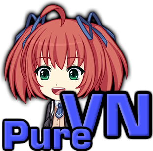
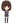
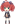
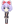
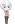

# Sunrider Academy PureVN Mod

[](https://github.com/trigger-death/SunriderAcademyPureVN/releases/latest)
[](https://github.com/trigger-death/SunriderAcademyPureVN/releases/latest)
[](https://github.com/trigger-death/SunriderAcademyPureVN/releases)
[](https://github.com/trigger-death/SunriderAcademyPureVN/commit/26464c07eab6544c8f300f8ae2965e5acfa535f4)
[](http://forum.loveinspace.moe/thread/631/sunrider-academy-purevn-activity-completion)
[](https://discord.gg/vB7jUbY)

PureVN is a mod to *optionally* eliminate all non-visual novel elements in [Sunrider Academy](https://vndb.org/v16221/chars) for a nice, smooth, *non-carpal-tunnel-inducing* story. As with any game mod, make sure to backup your saves before installation for maximum safety measures.

As of [v2.0.0.0](https://github.com/trigger-death/SunriderAcademyPureVN/releases/tag/2.0.0.0), PureVN supports the [Sunrider Academy Mod Interface](http://forum.loveinspace.moe/thread/625/sunrider-academy-mod-interface). Also as of [v2.0.0.0](https://github.com/trigger-death/SunriderAcademyPureVN/releases/tag/2.0.0.0), PureVN cannot be enabled or disabled without starting a new game. The benefit, is any game played without PureVN Mode, will function perfectly even after uninstalling the mod.

<p align="center"></p>

When starting a new game PureVN will ask you if you want to enabled **PureVN Mode** just before choosing your character class. If you have [Sunrider Academy Mod Interface](http://forum.loveinspace.moe/thread/625/sunrider-academy-mod-interface) installed, then you can access PureVN from the Mod menu instead. There are also console commands to change the Choice Outcome setting at any time:

```py
purevn.choice_outcome = True  # Enable Choice Outcome if PureVN Mode is enabled.
purevn.choice_outcome = False # Disable Choice Outcome if PureVN Mode is enabled.
purevn_status()  # Display whether PureVN Mode or Choice Outcome are enabled
```

**Choice Outcome** allows the player to choose the outcome of scenarios that are normally fixed in PureVN Mode, and rely on character stats in the normal gameplay. This allows you to encounter more unique dialogue than you would with fixed high stats. Making use of Choice Outcome will allow the player to access every bad end aside from hospitalization due to sickness.

PureVN **will not** interfere with gameplay when **PureVN Mode** is disabled. If gameplay while PureVN Mode is disabled is different in anyway, then please report it in the issues section.

## Installation

Installing is as easy as dragging the `game/` folder in zip file into the `%INSTALLDIR%/` directory and choose to merge the folders.<br/>
Uninstalling requires you remove the `%INSTALLDIR%/game/mods/purevn/` folder. Do not delete the `mods` folder if you have other mods installed.

**Note:** Installing PureVN will render any saves played with PureVN Mode non-functional. They will crash the game moment you load the save.

## How to Build

First you must download [rpatool](https://github.com/Shizmob/rpatool) and place the script in the root project directory. After that, building is as simple as running `python make.py --build`.

To deploy the Ren'Py script(s) and archive(s) to an installation directory, create `deploydir.txt` and list each location to deploy to on a separate line. Lines can be ignored by prefixing them with `>`. These files **must** direct to the `%INSTALLDIR%/` folder, and not a subfolder of the game. Use the following switches when running `make.py` for deployment:

```
usage: python make.py [-b|-d|-dbg|-c] [-o [OUT='deploydir.txt']]

A python script for comiling Ren'Py mods.

optional arguments:
  -b, --build        Build modules and rpas.
  -d, --deploy       Build and deploy modules and rpas.
  -dbg, --debug      Deploy source files and rpas.
  -c, --clean        Cleanup all deployed files (except large rpas).
  -o OUT, --out OUT  Specify the file listing directories to deploy to.
  -h, --help         Print this help and exit.

You may only pass up to one [-b|-d|-dbg|-c|-h] switch to make.py. In the 'OUT'
deployment file, lines starting with '>' are ignored.
```

## Auto-Activity Progress

Auto-Activity is the logic implemented to decide where to go during each activity in order to encounter all events. The decisions made are based on information gained from [tomak's Steam Guide](https://steamcommunity.com/sharedfiles/filedetails/?id=426915574). Auto-Activity does not perform any activity during the first 2 hours on days off.

* **Common Route:** `finished`
*  **Ava Route:** `finished`
*  **Asaga Route:** `finished`
*  **Chigara Route:** `finished`
*  **Sola Route:** `finished`

## Choice Outcome

**Choice Outcome** allows the user to choose the outcome of scenarios that are normally fixed in PureVN Mode. This allows you to encounter more dialogue choices than you would with high stats.

* **Competitions:** `finished`
* **Exams:** `finished`
* **Election:** `finished`
